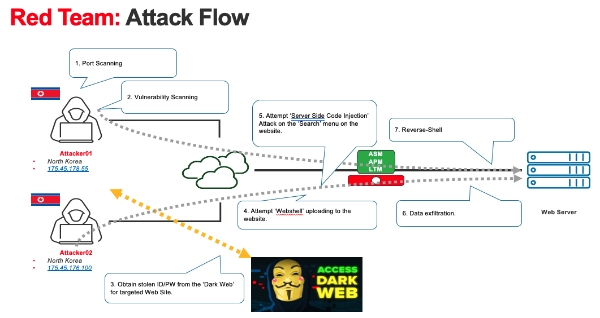

# Automated Threat Hunting and Security Remediation

## Summary
Threat hunting and incident investigation is a time-consuming job. If automation process flags the suspicious activities with the combinations of 'weak-signals' on the network, and performs the remediation process, it can dramatically reduce the risks on the company.
Below is the network diagram for this use-case.

## Prerequisites
- ELK(Elasticsearch, Logstash, Kibana) installed (required Platinum or Trial license)
- Ansible installed at same server with ELK
- F5 BIG-IP provisioned with AWAF/APM/LTM

## Use-Case Scenario
In this use-case, you will analyze F5 telemetry logs using ELK stack. You will import the sample F5 Telemetry logs later. This sample logs include normal web-requests from users in global and you will be able to find malicious attacks as well from logs. Once you successfully import sample ELK logs to the ELK in your lab, you can perform your own 'Threat Hunting' and perform the automated remediation using Ansible. 

### *Red Team*
While we don't include attack simulation process in this repo, it could be helpful for you to understand how whole attack process is proceeding by the attacker. 

## Setup and Configuration
Follow the links below in order to begin setup and configuration.
1. [Importing sample CSV files to your Kibana](https://github.com/network1211/f5-security-automation-ansible/blob/master/soc/threat_hunting/import_elk/import_elk.md)
2. [Creating Kibana Dashboard for SOC analysts](https://github.com/network1211/f5-security-automation-ansible/blob/master/soc/threat_hunting/kibana_dashboard/dashboard-main.md)
3. [Simulating 'Threat Hunting'](https://github.com/network1211/f5-security-automation-ansible/blob/master/soc/threat_hunting/hunting/hunting.md)
4. Automated Remediation using Ansible
