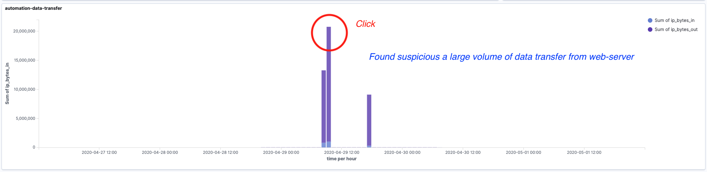
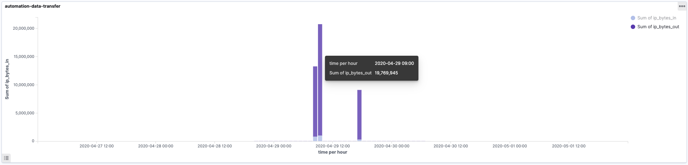
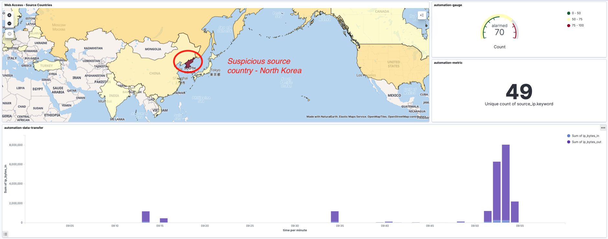
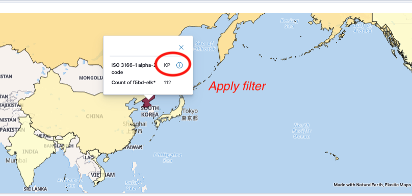
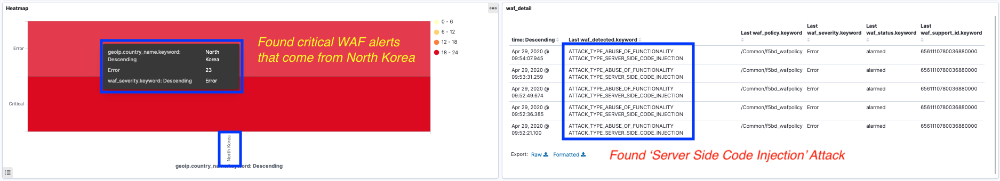
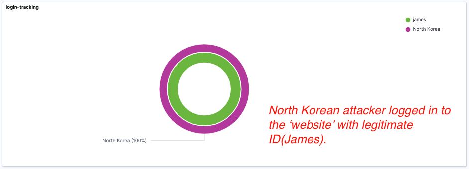
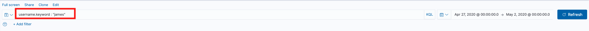
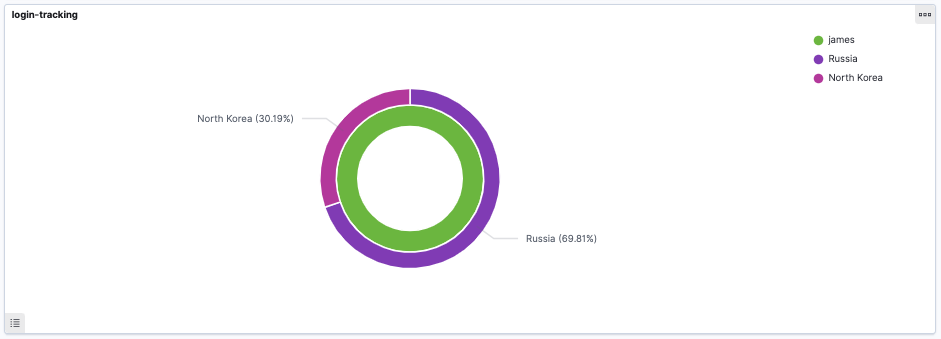
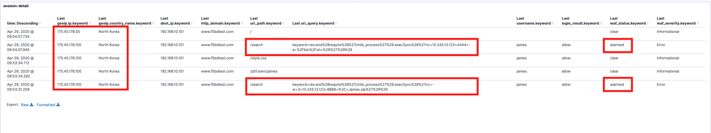

1. Suspicious large data transfer from web-server
You can find a suspicious large volume of data transfer in your Kibana dashboard.

2. Suspicious source country
Once you click the suspicious data transfer, you can see the connection came from North Korea. 

3. Apply source country filter

4. Confirm critical WAF alerts from North Korea
You can confirm critical alerts were detected but WAF triggered alarms only because it is configured the 'Transparent mode'. 

5. Suspicious login
North Korean attacker logged in to the 'website' with legitimate ID(James).

Clear the pre-applied country filter and apply a new filter - 'username:james' 

You can confirm that ID ‘James’ normally login from ‘Russia’. Now, you suspect this ID could be stolen by the attacker. 

6. Confirm detailed attack techniques
You can find how the attacker exfiltrated the data. 

