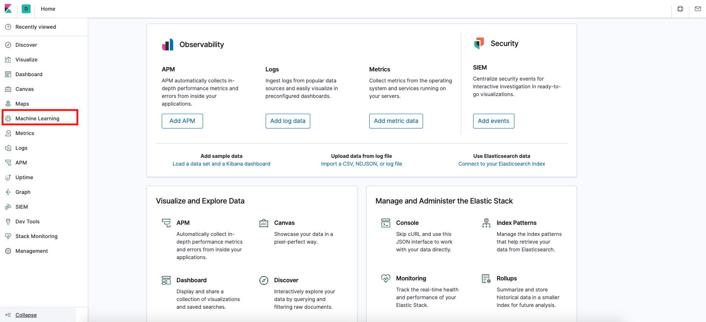
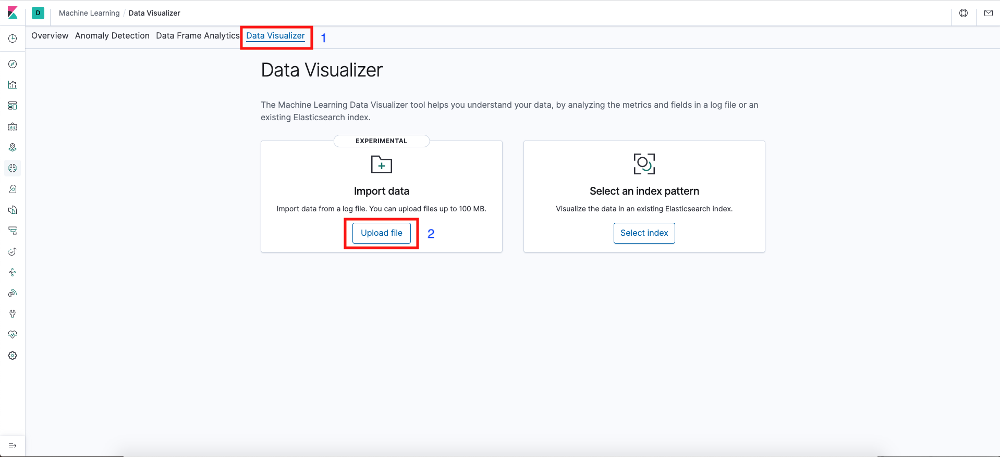
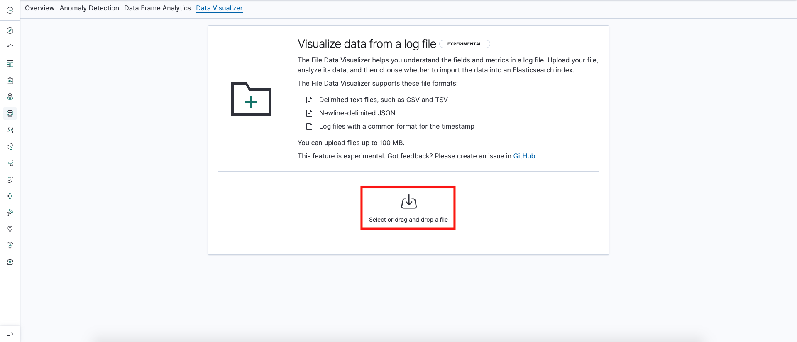
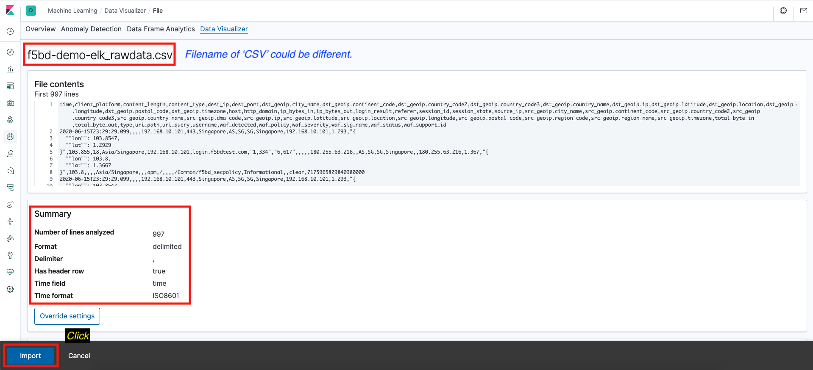
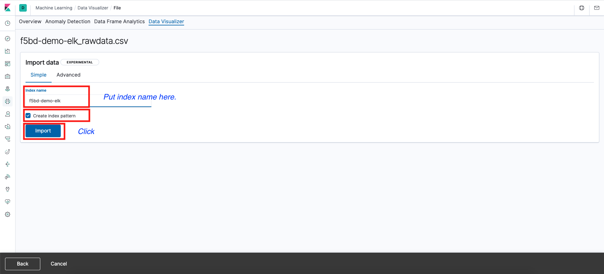
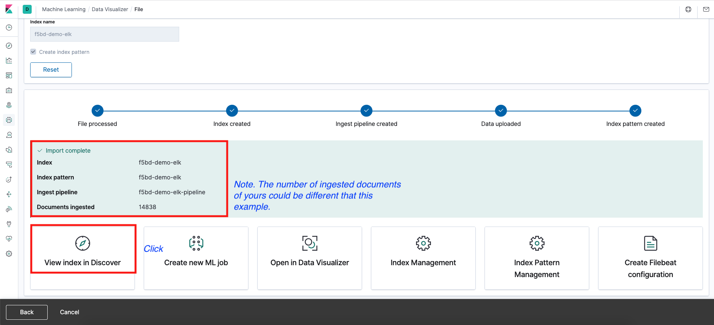

# Importing sample CSV files to your Kibana

## Configuration Step
### *Please make sure that your Elasticsearch already incliude 'Elastic Platinum License' or 'Trial License'.* 

1. Step 1

2. Step 2

3. Step 3

4. Step 4

5. Step 5

6. Step 6

7. Step 7

