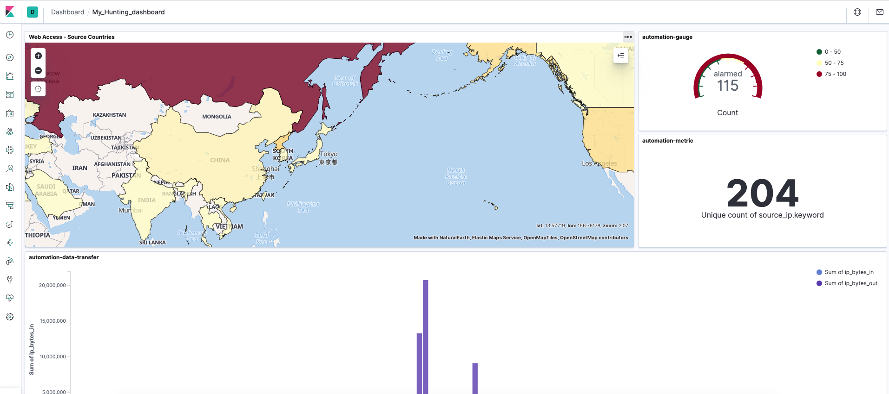

## Creating Kibana Dashboard for SOC analysts

1. [Monitoring number of WAF alerts](https://github.com/network1211/f5-security-automation-ansible/blob/master/soc/threat_hunting/kibana_dashboard/1-1.md)
2. [Monitoring number of unique Source IP Addresses](https://github.com/network1211/f5-security-automation-ansible/blob/master/soc/threat_hunting/kibana_dashboard/1-2.md)
3. [Monitoring Data Transfer from/to servers](https://github.com/network1211/f5-security-automation-ansible/blob/master/soc/threat_hunting/kibana_dashboard/1-3.md)
4. [Monitoring Critical WAF alerts per Countries](https://github.com/network1211/f5-security-automation-ansible/blob/master/soc/threat_hunting/kibana_dashboard/1-4.md)
5. [Monitoring WAF alert details](https://github.com/network1211/f5-security-automation-ansible/blob/master/soc/threat_hunting/kibana_dashboard/1-5.md)
6. [Monitoring Content-Type](https://github.com/network1211/f5-security-automation-ansible/blob/master/soc/threat_hunting/kibana_dashboard/1-6.md)
7. [Monitoring User Login Status](https://github.com/network1211/f5-security-automation-ansible/blob/master/soc/threat_hunting/kibana_dashboard/1-7.md)
8. [Session Details](https://github.com/network1211/f5-security-automation-ansible/blob/master/soc/threat_hunting/kibana_dashboard/1-8.md)
9. [Monitoring Web reqeusts using map](https://github.com/network1211/f5-security-automation-ansible/blob/master/soc/threat_hunting/kibana_dashboard/dashboard-map.md)

*Final Dashboard*

