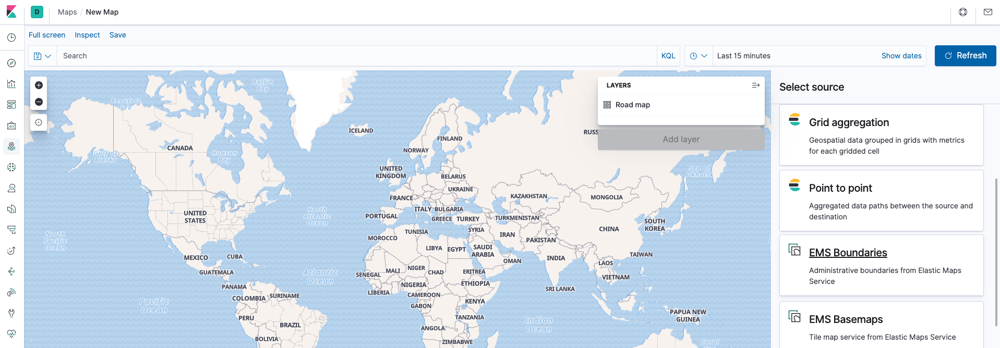
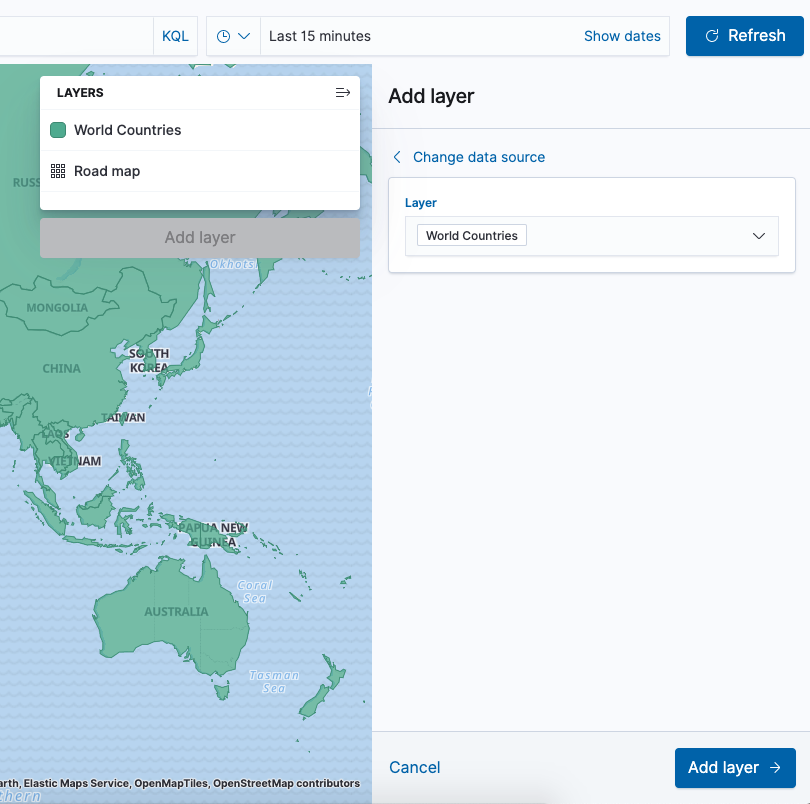
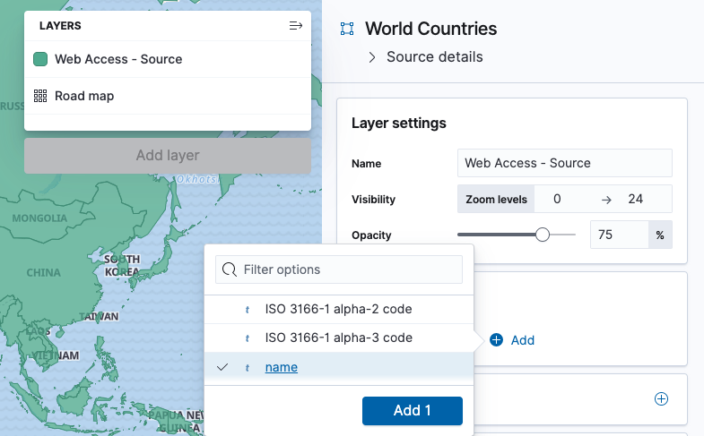
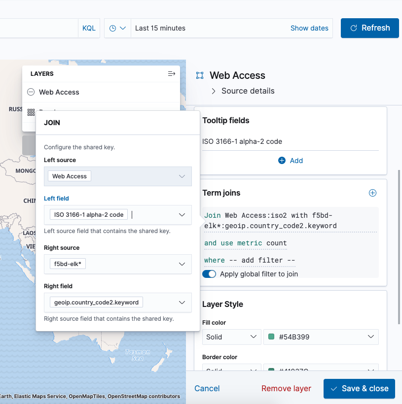
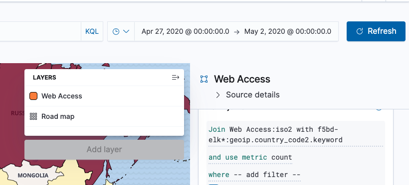
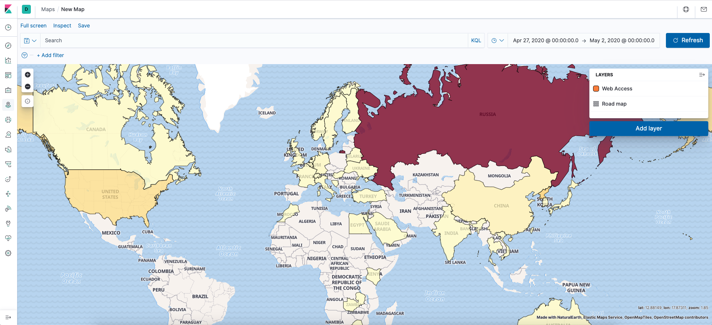
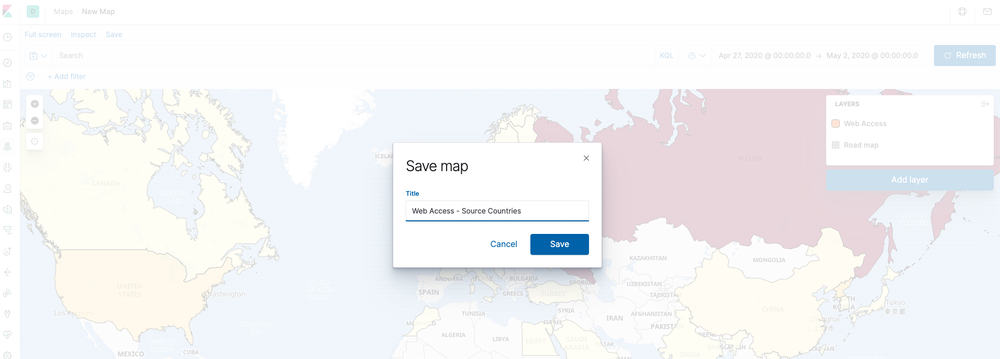

### Create 'Web Access' monitoring map

   *Kibana, Maps -> New map*
    

   *Add Layer -> Select 'World countries' -> Name (Web Access)*
    

   *'Tooltip fields' -> 'Add' -> Select 'name'*
    

   *'Term Joins' -> 'Add' -> 'Left source(Web Access)' -> Left field(ISO 3166-1 alpha-2 code) -> Right source(f5bd-elk) -> Right field(geoip.country_code2.keyword)*
    

   *Set time range from '27th Apr 2020 @ 00:00:00' to '2nd May 2020 @ 00:00:00'.*
    

   *Verify your map is similar with the below* 
    

   *Save your map*
    

   *Verify your map*
    
